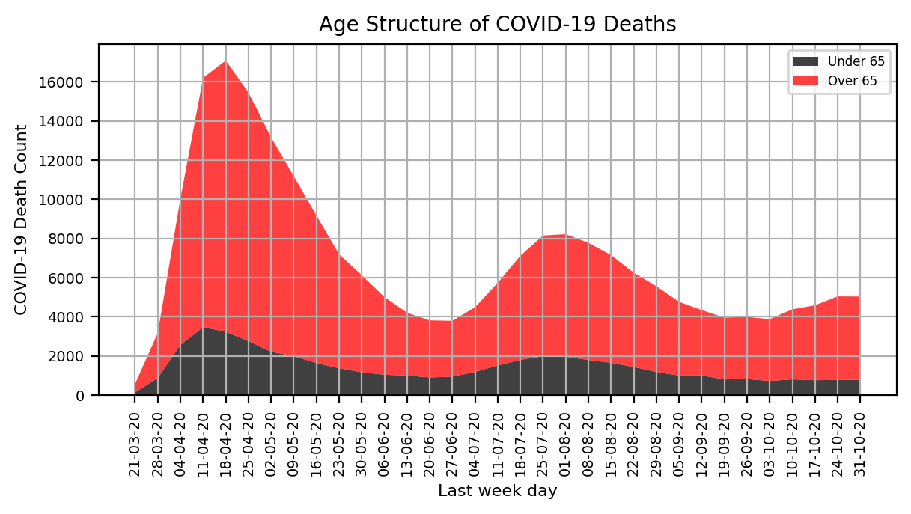
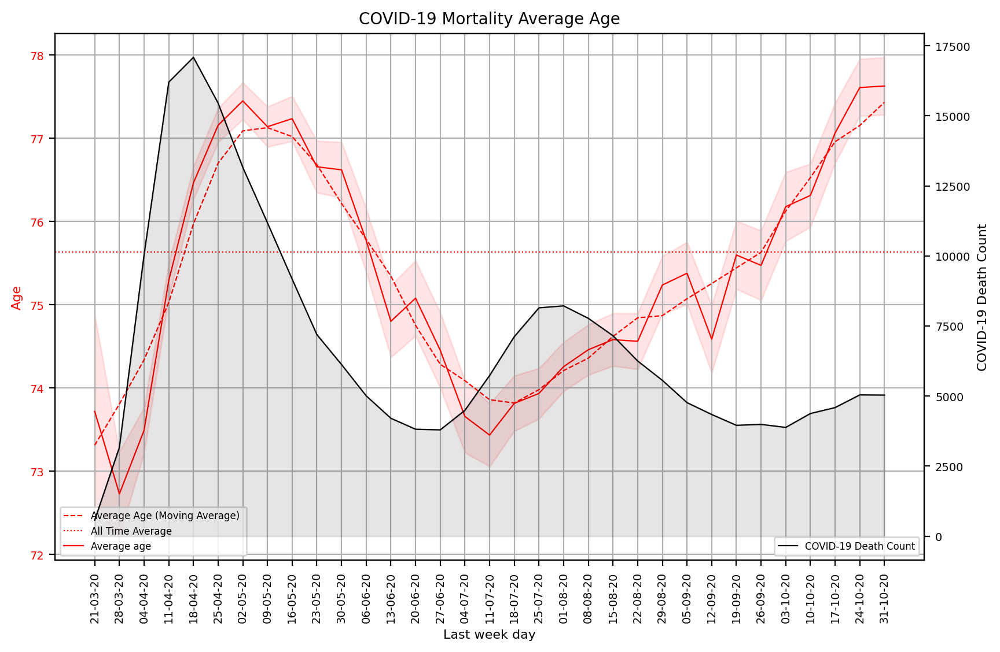

# COVID_CDC_Wave-Age-Trends
## Supplementary code for the preprint [COVID-19 Outbreaks and Age Mortality Patterns]().

  
   

### Authors:
- Vladimir Shapiro

### Prerequisites
- Python 3

### Instructions
- To replicate the results run **weekly_covid_cdc_mortality_tracking.ipynb** notebook.
- Modify the week range settings if wish to obtain up-to-date or arbitrary time period results.

### Citation
If you used this research please cite the original [paper](https://www.researchsquare.com/article/rs-113791/v1) DOI: 10.21203/rs.3.rs-113791/v1.

### Acknowledgements
The following repositories have been used:
- [Confidence intervals on linear regression](https://gist.github.com/riccardoscalco/5356167)
